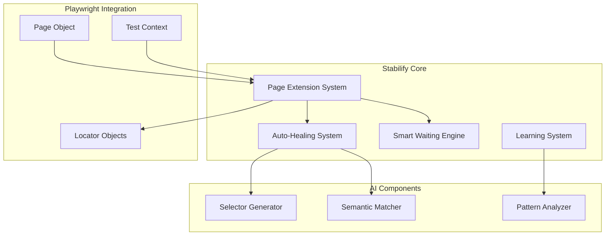
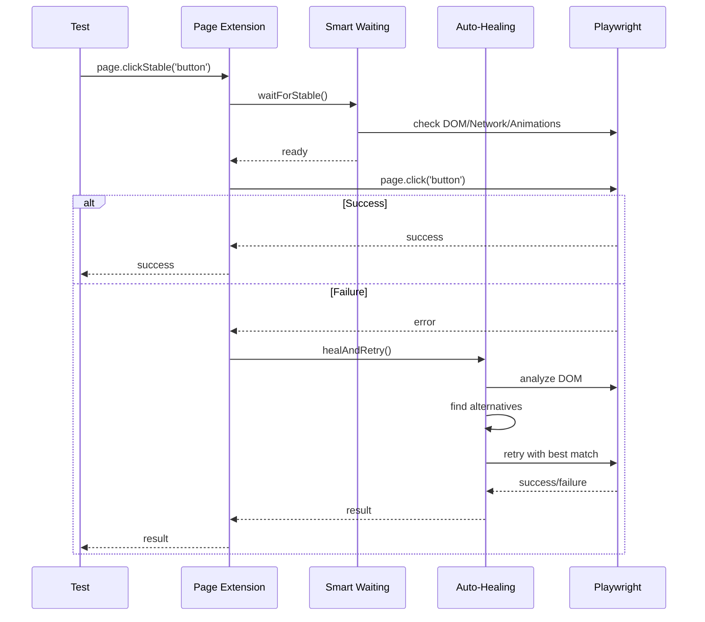

# 🏛️ Stabilify Architektur

## 🎯 System-Übersicht

## 🔧 Core-Module

### 1. Page Extension System

**Zweck:** Erweitert Playwright Page-Objekte um stable Methoden

**Komponenten:**

- Method Wrapper Factory
- Options Merger
- Error Handler Integration
- TypeScript Definitions

### 2. Smart Waiting Engine

**Zweck:** Intelligente Wartestrategien basierend auf Browser-Events

**Komponenten:**

- DOM Stability Detector
- Network Activity Monitor
- Animation Tracker
- Framework Hydration Detector

### 3. Auto-Healing System

**Zweck:** Automatische Reparatur fehlgeschlagener Selektoren

**Komponenten:**

- Error Analyzer
- Alternative Selector Generator
- Semantic Matcher
- Retry Coordinator

### 4. Learning System

**Zweck:** Kontinuierliche Verbesserung durch Pattern-Erkennung

**Komponenten:**

- Failure Pattern Collector
- Improvement Suggestion Engine
- Performance Analytics
- Reporting System

## 🚀 Datenfluss

